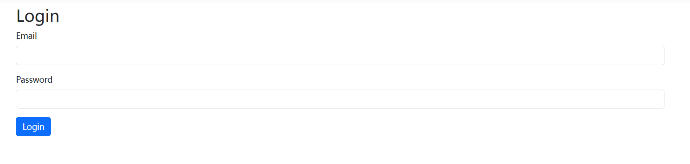
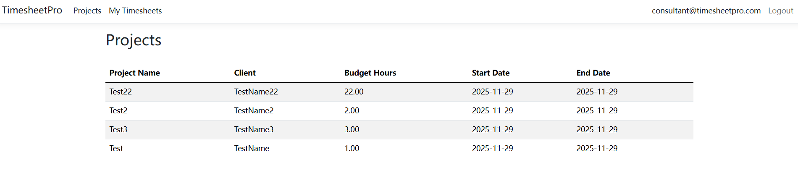
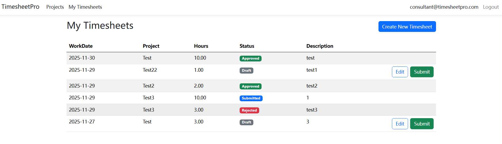
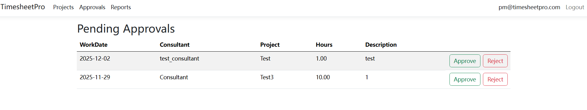
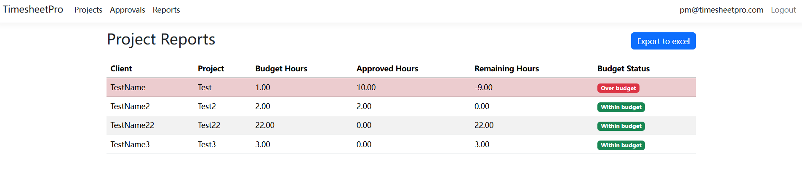

# TimesheetPro – Timesheet & Approval Management System

TimesheetPro is an internal **timesheet and approval management system** built with **ASP.NET Core MVC (.NET 8)**.

The application simulates a typical enterprise workflow used in consulting and finance organizations, where **consultants submit timesheets**, **project managers approve or reject them**, and **project managers / finance users review budget vs approved hours reports**.

---

## Key Features

### Authentication & Authorization
- ASP.NET Core Identity with **GUID-based users and roles**
- Role-based authorization (**Admin / Consultant / ProjectManager / Finance**)
- Role-based UI navigation

### Timesheet Workflow
- Consultants create timesheets as **Draft**
- Submit timesheets: **Draft → Submitted**
- Project Managers review and take action:
  - **Submitted → Approved**
  - **Submitted → Rejected**
- Validation of **allowed and invalid state transitions**
- Core workflow rules implemented in a dedicated **TimesheetService**

### Project Management
- Projects CRUD (budget hours, date range, description)
- Basic domain validation (e.g. StartDate ≤ EndDate)

### Approvals
- Project managers can review submitted timesheets
- Approve or reject with enforced state validation

### Reporting & Excel Export
- Project-level **BudgetHours vs ApprovedHours** overview
- Aggregated approved hours across all users
- Excel export implemented using **EPPlus**

### Testing
- Unit tests for core workflow rules using **xUnit**
- Validation of allowed and invalid state transitions

---

## Tech Stack

**Backend**
- ASP.NET Core MVC (.NET 8)
- Entity Framework Core
- ASP.NET Core Identity
- SQL Server
- Layered architecture inspired by Clean Architecture principles (**UI / Core / Infrastructure**)


**UI**
- Razor Views
- Bootstrap

**Testing & Tools**
- xUnit
- EPPlus (Excel export)

---

## Project Structure

```text
TimesheetPro
├── TimesheetPro.UI              // Controllers, Models, Views, Seed
├── TimesheetPro.Core            // Domain(Entities, IdentityEntities), Enums, Services
├── TimesheetPro.Infrastructure  // DbContext, Migrations
└── TimesheetPro.ServiceTests    // Unit tests
```

## Configuration & Secrets

This repository does **not** include real credentials.

To run the project locally:

1. Copy:
   - `TimesheetPro.UI/appsettings.example.json`
   to:
   - `TimesheetPro.UI/appsettings.json`

2. Update the following values in `appsettings.json`:
   - `ConnectionStrings:DefaultConnection`
   - EPPlus license name (non-commercial)

## Getting Started (Development)

### Backend

1. Make sure SQL Server (LocalDB or SQL Server Express) is available
2. Apply Entity Framework Core migrations
3. Run the application

## Screenshots

### Login


### Projects


### MyTimesheets


### Approvals


### Reports


## License

This project is intended for **portfolio demonstration purposes**.